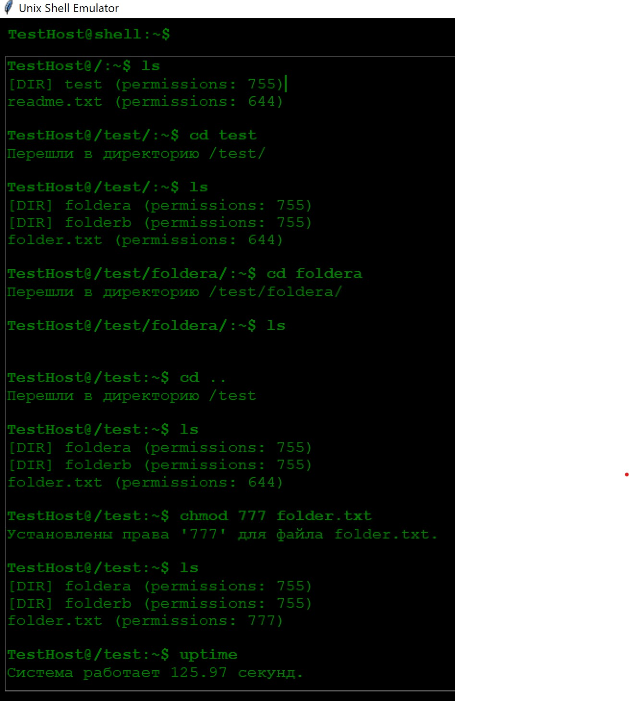

# FSemylator

https://github.com/AnikaDev/FSemylator

## 1. Общее описание
Разработать эмулятор для языка оболочки ОС. Необходимо сделать работу
эмулятора как можно более похожей на сеанс shell в UNIX-подобной ОС.
Эмулятор должен запускаться из реальной командной строки, а файл с
виртуальной файловой системой не нужно распаковывать у пользователя.
Эмулятор принимает образ виртуальной файловой системы в виде файла формата
zip. Эмулятор должен работать в режиме GUI.
Конфигурационный файл имеет формат ini и содержит:
• Имя компьютера для показа в приглашении к вводу.
• Путь к архиву виртуальной файловой системы.
• Путь к лог-файлу.
• Путь к стартовому скрипту.
Лог-файл имеет формат json и содержит все действия во время последнего
сеанса работы с эмулятором.
Стартовый скрипт служит для начального выполнения заданного списка
команд из файла.
Необходимо поддержать в эмуляторе команды ls, cd и exit, а также
следующие команды:
1. chmod.
2. uptime.
3. rm.
Все функции эмулятора должны быть покрыты тестами, а для каждой из
поддерживаемых команд необходимо написать 2 теста.

## 2. Описание всех функций и настроек.

### Функции эмулятора

#### `__init__(config_path: str)`
- **Описание**: Инициализирует эмулятор, загружает конфигурацию, виртуальную файловую систему (VFS) и выполняет скрипт запуска.
- **Параметры**:
  - `config_path`: Путь к конфигурационному файлу.
- **Работа**: 
  - Загружает конфигурации (например, имя компьютера, путь к VFS, путь к лог-файлу).
  - Инициализирует логирование и текущую директорию.
  - Выполняет команды из стартового скрипта.

#### `load_virtual_fs(vfs_path: str)`
- **Описание**: Загружает виртуальную файловую систему из ZIP-архива.
- **Параметры**:
  - `vfs_path`: Путь к ZIP-архиву с файловой системой.
- **Работа**: Декодирует содержимое файлов и добавляет атрибуты (права доступа, тип).

#### `ls()`
- **Описание**: Список файлов и папок в текущей директории.
- **Вывод**: 
  - Названия файлов/папок, их тип (файл/директория) и права доступа.

#### `cd(path: str)`
- **Описание**: Переходит в указанную директорию.
- **Параметры**:
  - `path`: Путь к директории.
- **Ошибки**:
  - Директория не найдена или это файл.

#### `chmod(args: List[str])`
- **Описание**: Меняет права доступа к файлу.
- **Параметры**:
  - `args[1]`: Новые права доступа (например, `644`).
  - `args[2]`: Имя файла.
- **Ошибки**:
  - Файл не найден.

#### `rm(file_name: str)`
- **Описание**: Удаляет файл из текущей директории.
- **Параметры**:
  - `file_name`: Имя файла.
- **Ошибки**:
  - Файл не найден или это папка.

#### `uptime()`
- **Описание**: Показывает время работы системы в секундах.
- **Вывод**: Строка в формате: `"Система работает X.XX секунд."`

#### `exit()`
- **Описание**: Завершает работу эмулятора.
- **Вывод**: `"Выход из системы."`

#### `log_command(command: str, output: str)`
- **Описание**: Логирует команды пользователя и их результаты.
- **Параметры**:
  - `command`: Имя команды.
  - `output`: Результат выполнения команды.

### Настройки программы

#### Конфигурационный файл (`config.txt`)
- **Формат**: INI.
- **Содержимое**:
  ```ini
  [Settings]
  computer_name = TestMachine
  virtual_fs_path = test_fs.zip
  log_path = test_log.json
  startup_script = test_startup.txt

## 3. Описание команд для запуска проекта.
python shell_emulator.py

## 4. Примеры использования в виде скриншотов



## 5. Результаты прогона тестов.
python tests.py
Testing started at 23:32 ...
Launching unittests with arguments python -m unittest tests.TestShellEmulator in C:\prj\python\FSemylator

Config file:test_config.txt
Запуск команды из скрипта: ls

[DIR] dir1 (permissions: 755)
test_file.txt (permissions: 644)
Config file:test_config.txt
Запуск команды из скрипта: ls

[DIR] dir1 (permissions: 755)
test_file.txt (permissions: 644)
Config file:test_config.txt
Запуск команды из скрипта: ls

[DIR] dir1 (permissions: 755)
test_file.txt (permissions: 644)
Config file:test_config.txt
Запуск команды из скрипта: ls

[DIR] dir1 (permissions: 755)
test_file.txt (permissions: 644)
[DIR] dir1 (permissions: 755)
test_file.txt (permissions: 644)
Система работает 0.00 секунд.
Config file:test_config.txt
Запуск команды из скрипта: ls

[DIR] dir1 (permissions: 755)
test_file.txt (permissions: 644)
[DIR] dir1 (permissions: 755)
test_file.txt (permissions: 644)
Config file:test_config.txt
Запуск команды из скрипта: ls

[DIR] dir1 (permissions: 755)
test_file.txt (permissions: 644)
Config file:test_config.txt
Запуск команды из скрипта: ls

[DIR] dir1 (permissions: 755)
test_file.txt (permissions: 644)
Config file:test_config.txt
Запуск команды из скрипта: ls

[DIR] dir1 (permissions: 755)
test_file.txt (permissions: 644)
Система работает 0.00 секунд.


Ran 8 tests in 0.095s

OK