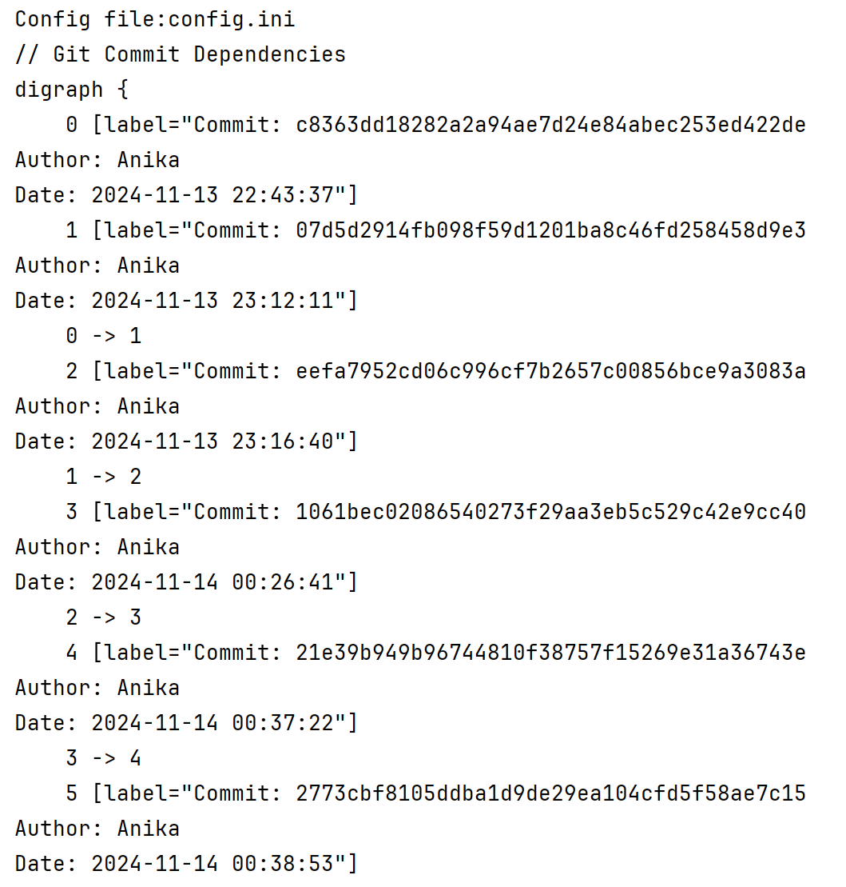

1. Общее описание.
Разработать инструмент командной строки для визуализации графа
зависимостей, включая транзитивные зависимости. Сторонние средства для
получения зависимостей использовать нельзя.
80
Зависимости определяются для git-репозитория. Для описания графа
зависимостей используется представление Graphviz. Визуализатор должен
выводить результат на экран в виде кода.
Построить граф зависимостей для коммитов, в узлах которого содержатся
дата, время и автор коммита.
Конфигурационный файл имеет формат toml и содержит:
• Путь к программе для визуализации графов.
• Путь к анализируемому репозиторию.
• Путь к файлу-результату в виде кода.
Все функции визуализатора зависимостей должны быть покрыты тестами.

2. Описание всех функций и настроек.
Описание функций
load_config(config_file: str) -> dict

Загружает настройки конфигурации из указанного INI-файла.
Аргументы:
config_file: Путь к INI-файлу конфигурации.
Возвращает:
Словарь, содержащий настройки конфигурации.
Поведение:
Читает INI-файл и парсит его секции и параметры.
get_commits(repo_path: str, since_date: str) -> List[Tuple[str, str]]

Извлекает список коммитов из указанного Git-репозитория с заданной даты.
Аргументы:
repo_path: Путь к Git-репозиторию.
since_date: Строка даты (например, "2023-01-01"), начиная с которой нужно получить историю коммитов.
Возвращает:
Список кортежей. Каждый кортеж содержит:
Хэш коммита.
Дату коммита в формате "YYYY-MM-DD HH:MM
".
Автора коммита.
Исключения:
Вызывает исключение, если выполнение команды Git завершается с ошибкой.
build_dependency_graph(commits: List[Tuple[str, str]]) -> Digraph

Создает граф зависимостей коммитов с использованием Graphviz.
Аргументы:
commits: Список данных о коммитах в хронологическом порядке (хэш коммита, дата, автор).
Возвращает:
Объект Digraph, представляющий граф зависимостей.
Поведение:
Создает узел для каждого коммита и соединяет их в хронологическом порядке.
save_graph(graph: Digraph, output_file: str) -> None

Сохраняет сгенерированный граф зависимостей в файл формата PNG.
Аргументы:
graph: Объект Digraph, который нужно сохранить.
output_file: Путь к файлу для сохранения (без расширения).
Поведение:
Сохраняет граф в формате PNG по указанному пути.
main(config_file: str) -> None

Главная функция, которая организует загрузку конфигурации, извлечение коммитов, создание графа и его сохранение.
Аргументы:
config_file: Путь к INI-файлу конфигурации.
Поведение:
Загружает настройки, получает данные о коммитах, строит граф зависимостей и сохраняет его.
Настройки конфигурационного файла
Конфигурационный файл (config.ini) должен содержать следующие секции и ключи:

[Settings]
repository_path=C:/prj/python/FSemylator/.git
graph_output_path=C:/prj/python/FSemylator/task2/git/out
since_date=2024-11-01
graphviz=C:\Program Files\Graphviz\bin

3. Описание команд для сборки проекта.
python show_commits
pip install graphviz и установить саму программу Graphviz

4. Примеры использования в виде скриншотов, желательно в
анимированном/видео формате, доступном для web-просмотра.

5. Результаты прогона тестов.
Testing started at 19:15 ...
Launching unittests with arguments python -m unittest C:\prj\python\FSemylator\task2\git\test.py in C:\prj\python\FSemylator\task2\git

result: abc123 1672531200 Anika
xyz789 1672617600 Anna

Ran 4 tests in 0.010s
