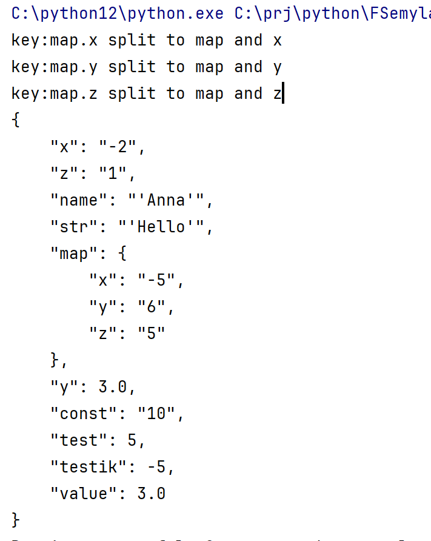
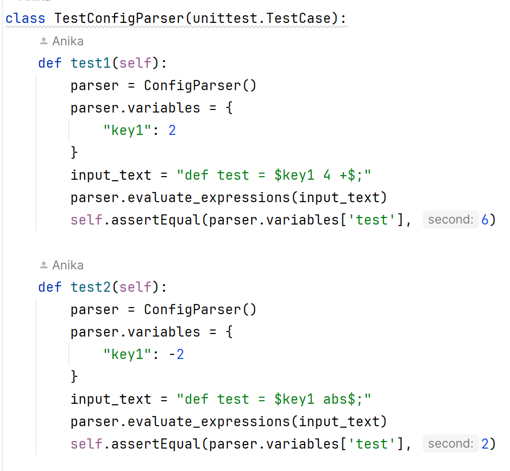
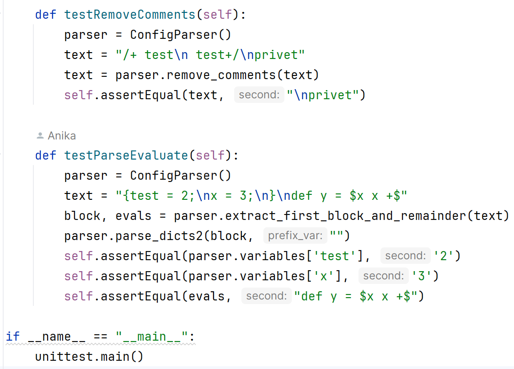

1. Общее описание.
    Разработать инструмент командной строки для учебного конфигурационного
    языка, синтаксис которого приведен далее. Этот инструмент преобразует текст из
    входного формата в выходной. Синтаксические ошибки выявляются с выдачей
    сообщений.
    Входной текст на учебном конфигурационном языке принимается из
    стандартного ввода. Выходной текст на языке json попадает в стандартный
    вывод.
    Многострочные комментарии:
    /+
    Это многострочный
    комментарий
    +/
    Словари:
    {
     имя = значение;
     имя = значение;
     имя = значение;
     ...
    }
    Имена:
    [a-z]+
    81
    Значения:
    • Числа.
    • Строки.
    • Словари.
    Строки:
    'Это строка'
    Объявление константы на этапе трансляции:
    def имя = значение;
    Вычисление константного выражения на этапе трансляции (постфиксная
    форма), пример:
    $имя 1 +$
    Результатом вычисления константного выражения является значение.
    Для константных вычислений определены операции и функции:
    ~Сложение.
    ~Вычитание.
    ~Умножение.
    ~Деление.
    ~abs().
    ~mod().

2. Описание всех функций и настроек.
   1. __init__(self)
   Инициализирует объект класса ConfigParser. Создает два словаря:

    constants — для хранения констант.
    variables — для хранения переменных, которые будут вычислены в ходе работы.
    2. parse(self, text: str) -> Dict[str, Any]
    Основной метод для обработки входного текста:

    Удаляет комментарии с помощью remove_comments.
    Извлекает первый блок данных и остаток текста с помощью extract_first_block_and_remainder.
    Нормализует текст (удаляет лишние пробелы).
    Парсит словари через parse_dicts2.
    Вычисляет выражения через evaluate_expressions.
    Возвращает результат в виде словаря.
    3. extract_first_block_and_remainder(self, text: str)
    Извлекает первый блок в фигурных скобках {} и оставшийся текст:
    
    Использует стек для определения границ блока.
    Возвращает блок и остаток текста, если блок найден, иначе — None и весь текст.
    4. remove_comments(self, text: str) -> str
    Удаляет многострочные комментарии вида /+ ... +/ из текста, используя регулярные выражения.
    
    5. remove_dicts_block(self, text: str) -> str
    Удаляет содержимое всех блоков, заключенных в {}, из текста.
    
    6. evaluate_postfix(self, expression)
    Вычисляет выражение, записанное в постфиксной форме:
    
    Поддерживает арифметические операции (+, -, *, /, abs, mod).
    Использует стек для пошагового выполнения операций.
    Выбрасывает исключения для некорректных выражений.
    7. parse_dicts2(self, block: str, prefix_var: str)
    Рекурсивно парсит строку с вложенными ключами и значениями:
    
    Если значение — вложенный блок {...}, вызывает себя рекурсивно.
    Добавляет переменные с префиксом prefix_var в словарь variables.
    8. evaluate_expressions(self, text: str)
    Вычисляет выражения в текстовом блоке:
    
    Заменяет переменные на их значения.
    Определяет выражения в формате $...$ для обработки через evaluate_postfix.
    Обновляет значения переменных в словаре variables.
    9. save_to_json(self, data: Dict[str, Any], output_file: str)
    Сохраняет результат парсинга в JSON-файл:
    
    Создает JSON-объект с ключом variables.
    Записывает его в указанный файл с отступами для читабельности.

3. Описание команд для сборки проекта.
    config.txt — файл с настройками (myProgramm=<входной_файл>, result.json=<выходной_файл>).

4. Примеры использования в виде скриншотов, желательно в
анимированном/видео формате, доступном для web-просмотра.

5. Результаты прогонов тестов

![Результы прогонов тестов(img_1.png)

Сами тесты:

